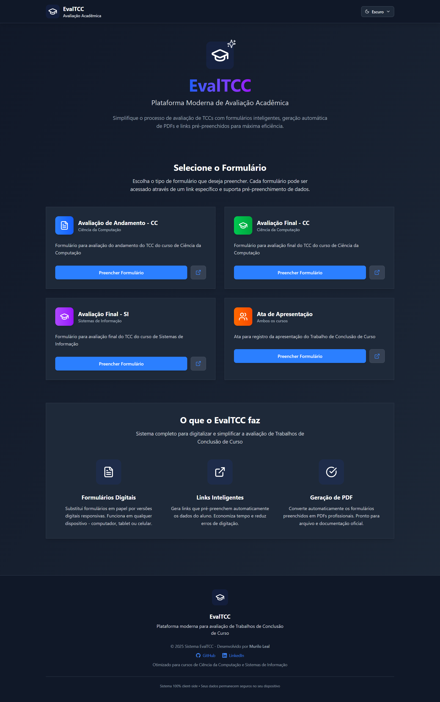

# Sistema de Formulários TCC - UFSM

Sistema web para avaliação de Trabalhos de Conclusão de Curso dos cursos de Ciência da Computação e Sistemas de Informação da Universidade Federal de Santa Maria.



Acesso: https://evaltcc.netlify.app/

### Desenvolvedor

Murilo Leal - Ciência da Computação - UFSM

## 🎯 Funcionalidades

- **Formulários Digitais Responsivos**: Interface otimizada para desktop e mobile
- **Links Pré-preenchidos**: Geração de URLs que pré-preenchem automaticamente os dados do aluno
- **Geração de PDF**: Exportação dos formulários preenchidos em formato PDF
- **Múltiplos Tipos de Formulário**:
  - Avaliação de Andamento - Ciência da Computação
  - Avaliação Final - Ciência da Computação
  - Avaliação Final - Sistemas de Informação
  - Ata de Apresentação de TCC

## 🚀 Tecnologias Utilizadas

- **Next.js 15** - Framework React com App Router
- **TypeScript** - Tipagem estática
- **Tailwind CSS** - Framework CSS utilitário
- **React Hook Form** - Gerenciamento de formulários
- **Zod** - Validação de esquemas
- **jsPDF** - Geração de PDFs
- **html2canvas** - Captura de elementos HTML
- **Lucide React** - Ícones

## 📋 Pré-requisitos

- Node.js 18+
- npm, yarn, pnpm ou bun

## 🛠️ Instalação e Execução

1. **Clone o repositório**

```bash
git clone <url-do-repositorio>
cd tcc-forms
```

2. **Instale as dependências**

```bash
npm install
# ou
yarn install
# ou
pnpm install
```

3. **Execute o servidor de desenvolvimento**

```bash
npm run dev
# ou
yarn dev
# ou
pnpm dev
```

4. **Acesse a aplicação**
   Abra [http://localhost:3000](http://localhost:3000) no seu navegador.

## 📁 Estrutura do Projeto

```
src/
├── app/                    # App Router do Next.js
│   ├── forms/
│   │   └── [formType]/    # Páginas dinâmicas dos formulários
│   ├── globals.css        # Estilos globais
│   ├── layout.tsx         # Layout principal
│   └── page.tsx           # Página inicial
├── components/            # Componentes reutilizáveis
│   ├── EvaluationTable.tsx
│   ├── FormField.tsx
│   └── LinkGenerator.tsx
├── types/                 # Definições de tipos TypeScript
│   └── forms.ts
└── utils/                 # Utilitários
    ├── pdfGenerator.ts
    └── urlUtils.ts
```

## 🎨 Funcionalidades Detalhadas

### Formulários Disponíveis

1. **Avaliação de Andamento - CC** (`/forms/avaliacao_andamento_cc`)

   - Fundamentação teórica
   - Metodologia
   - Desenvolvimento
   - Cronograma
   - Apresentação

2. **Avaliação Final - CC** (`/forms/avaliacao_final_cc`)

   - Fundamentação teórica
   - Metodologia
   - Desenvolvimento e resultados
   - Conclusões
   - Apresentação

3. **Avaliação Final - SI** (`/forms/avaliacao_final_si`)

   - Fundamentação teórica
   - Metodologia
   - Desenvolvimento e implementação
   - Resultados e análise
   - Apresentação

4. **Ata de Apresentação** (`/forms/ata_apresentacao`)
   - Apresentação do trabalho
   - Defesa e arguição
   - Qualidade do trabalho escrito

### Gerador de Links

Cada formulário possui um gerador de links pré-preenchidos acessível em:
`/forms/[formType]/generator`

**Parâmetros suportados:**

- `studentName` - Nome do aluno
- `registration` - Matrícula
- `course` - Curso (CC ou SI)
- `advisor` - Orientador
- `coadvisor` - Coorientador
- `title` - Título do trabalho
- `semester` - Semestre/Ano (formato: "semestre/ano", ex: "2025/1")
- `evaluatorName` - Nome do avaliador
- `evaluatorInstitution` - Instituição do avaliador
- `evaluationDate` - Data da avaliação

**Exemplo de URL gerada:**

```
http://localhost:3000/forms/avaliacao_final_cc?studentName=João%20Silva&registration=123456&course=CC&advisor=Prof.%20Maria
```

### Sistema de Avaliação

- **Notas**: Escala de 0 a 10 com uma casa decimal
- **Pesos**: Cada critério possui um peso específico
- **Cálculo automático**: Média ponderada calculada automaticamente
- **Status**: Aprovado (≥6.0) ou Reprovado (<6.0)
- **Observações**: Campo para comentários por critério e observações gerais

## 📱 Responsividade

O sistema foi desenvolvido com foco em responsividade, funcionando adequadamente em:

- Desktop (1024px+)
- Tablet (768px - 1023px)
- Mobile (320px - 767px)

## 🔒 Segurança e Privacidade

- **Client-side**: Toda a aplicação roda no cliente, sem envio de dados para servidores
- **Armazenamento local**: Dados salvos apenas no localStorage do navegador
- **URLs seguras**: Parâmetros passados via URL de forma transparente

## 📄 Licença

Este projeto foi desenvolvido para uso acadêmico na Universidade Federal de Santa Maria.

---

Projeto entregue para a disciplina de [Desenvolvimento de Software para a Web](http://github.com/andreainfufsm/elc1090-2025a) em 2025a
